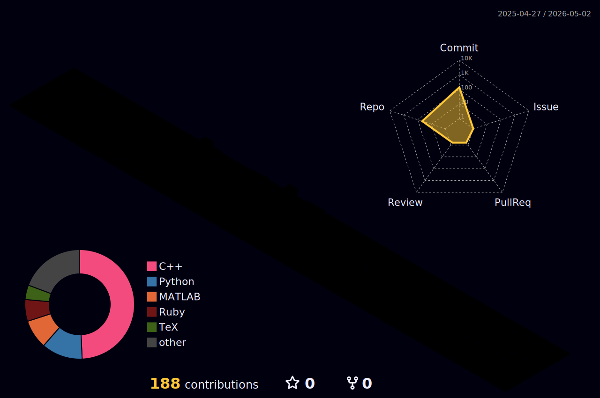

<h1> 𝐇𝐞𝐥𝐥𝐨, Everyone!  </h1>

**Undergraduate student in Aerospace and Electrical Engineering**

* 📌 𝘛𝘩𝘪𝘴 𝘎𝘪𝘵𝘏𝘶𝘣 𝘱𝘳𝘰𝘧𝘪𝘭𝘦 𝘪𝘴 𝘱𝘢𝘳𝘵 𝘰𝘧 𝘮𝘺 𝘤𝘰𝘭𝘭𝘦𝘨𝘦 𝘢𝘱𝘱𝘭𝘪𝘤𝘢𝘵𝘪𝘰𝘯 𝘢𝘯𝘥 𝘱𝘰𝘳𝘵𝘧𝘰𝘭𝘪𝘰 

* 🛠 I aim to document my engineering projects so others can follow, replicate, and learn from them

* 🚀 Passionate about aerospace engineering and the real-world applications of physics & calculus

* 📁 This Github also serves as my personal archive & an open resource

## ✅ Languages and Tools

  <!-- Python -->
  
  
  <!-- MATLAB -->
  

  <!-- C -->
  

  <!-- C++ -->
  

  <!-- Arduino -->
  

## 🌱 I am currently learning: 
<!-- LaTeX -->
<!-- ROS (Robot Operating System) -->
<!-- OpenCV -->
<!-- Julia -->
 

  

